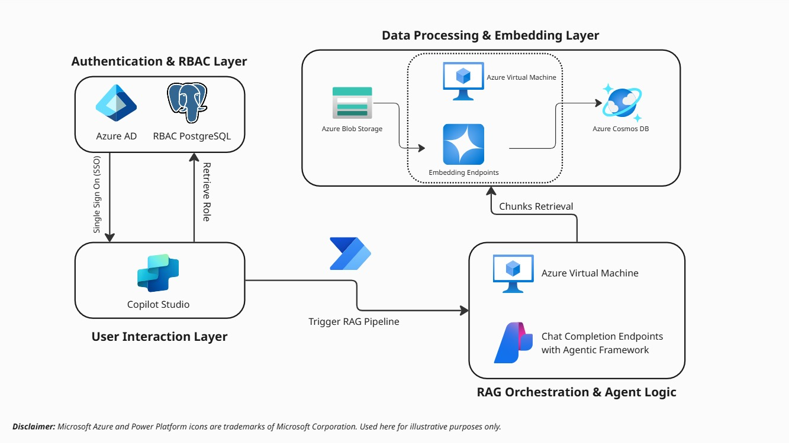

# CG - Azure RAG Copilot Chatbot (Azure AD)

> End‑to‑end chatbot solution for Microsoft Copilot Studio with FastAPI, Azure OpenAI (GPT‑4o mini), Azure Cosmos DB vector search, and Azure Blob Storage. Includes secure REST APIs, retrieval‑augmented generation (RAG), adaptive cards, and deployment via Docker/Jenkins.

## Features

- RAG pipeline: chunking, embeddings, vector search on Azure Cosmos DB for NoSQL

- File ingestion: PDF upload to Azure Blob Storage with metadata

- Chat service: FastAPI endpoints for chat, history, and file upload

- Models: Azure OpenAI GPT‑4o mini (chat) + text-embedding-3-large (embeddings)

- Copilot Studio integration: topics for intent routing, and citation rendering

- Security: JWT auth, CORS, API key optional, request logging, rate‑limit hooks

- DevOps: Docker image, Jenkins pipeline (Optional)

## Architecture



## Prerequisites

- Azure Subscription with access to Azure OpenAI, Azure Cosmos DB, and Azure Blob Storage
- Copilot Studio access
- Python installation (3.8+)
- Azure Virtual Machine - Ubuntu Server

## Setup Instructions

- In progress ...

## Quick Start (On-Premises) - Not Final

1. Create and activiate a virtual environment:

   ```bash
   python -m venv venv
   source venv/bin/activate  # On Windows use `venv\Scripts\activate`
   ```
2. Install dependencies:

   ```bash
    pip install -r requirements.txt
    ```
3. Run the FastAPI app:

   ```bash
   python app.py
   ```
4. Access the API at `http://localhost:8001`.

## License
MIT License. See `LICENSE` file for details.
